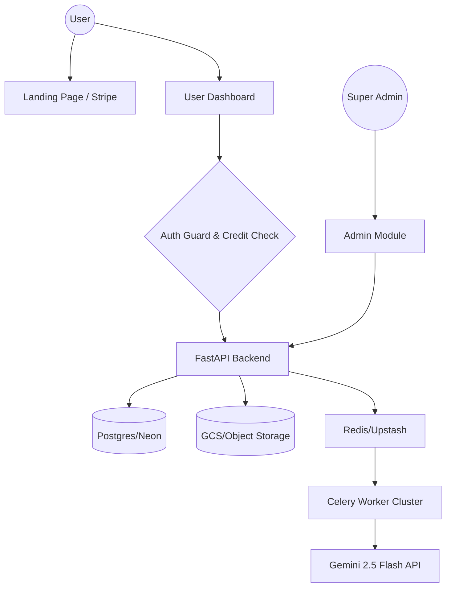

# Technical Book Translator: Strategic Roadmap & Implementation Plan

## 1. Value Proposition & Monetization Strategy (Optimized for AI Costs)

### The Niche: "Technical Archeology & Global Knowledge Bridging"
The true value of this system isn't just "translation"—it's **Preservation and Accessibility of specialized engineering knowledge**. Many critical technical manuals (maritime, aerospace, heavy machinery) exist only in their original languages (Japanese, German, Russian) and are out of print.

### Hybrid Monetization Models (Protecting Against Heavy Usage)
Since Gemini API costs are per-token/per-page, a pure unlimited subscription is risky. We should use a **Usage-Based Credit System**:

1.  **Subscription + Credit Refill (Common Method)**:
    *   **Pro ($29/mo)**: Includes **300 "Page Credits"** per month. Unused credits don't roll over.
    *   **Scale ($79/mo)**: Includes **1,000 "Page Credits"** per month.
    *   **Add-on Credits**: Buy 100 extra credits for $10 at any time.
    *   *Why this works*: Predictable revenue for you, while capping your API cost risk.

2.  **Pay-Per-Book (Transaction Model)**:
    *   Flat fee: **$5.00 + $0.15 per page**.
    *   *Why this works*: Ideal for hobbyists who only have one 50-page manual to translate and don't want a subscription.

3.  **Enterprise/Bulk**:
    *   Pre-paid packs of 10,000 pages for companies at a discounted rate.

### Advertising Strategy
*   **Targeted Communities**: Subreddits like r/Engineering, r/Manuals, r/Machinist, and niche forums (e.g., Japanese tractor enthusiasts, vintage HAM radio groups).
*   **Content Marketing**: "The Lost Manuals" series—blog posts showing before/after of iconic technical diagrams being brought back to life in English.

---

## 2. Feature Specification

### A. User Dashboard (The "Book Vault")
*   **Project Library**: Grid/List view of all books with cover thumbnails.
*   **Credit Monitor**: Prominent display of "Pages Remaining" in the billing month.
*   **Real-time Progress Tracker**: Radial progress bar for ongoing translations.
*   **Quality Insight Panel**: "Confidence Scores" for each book based on OCR accuracy.
*   **Interactive Review**: Ability to click a page, see side-by-side (Original vs. Translated), and manual override for critical labels.
*   **Unified Export**: One-click "Merge to Book" and "Download High-Res PDF."

### B. Super Admin Module (The "Engine Room")
*   **System Health Dashboard**:
    *   Total pages processed (24h/7d/30d).
    *   **Actual vs. Expected API Cost**: Tracking Gemini usage against revenue.
    *   Worker queue latency (Celery/Redis status).
*   **User Management**: Credit manual overrides, usage history logs.
*   **Failure Monitor**: Visual board of "Failed Pages" to identify patterns in difficult diagrams.

### C. Landing Page
*   **"Magic" Demo**: A draggable "before/after" slider on a complex technical diagram.
*   **Credit-Based Pricing Table**: Transparently explaining that 1 page = 1 credit.

---

## 3. Hosting & Deployment Strategy (Maximum Free Tier Usage)

### Recommended Stack
1.  **Frontend/Streamlit**: **Railway** or **Streamlit Cloud**. Railway has a generous $5 trial and high reliability.
2.  **API/Backend**: **Render** or **Railway**. Render offers a free tier for web services.
3.  **Database (PostgreSQL)**: **Supabase** or **Neon.tech**. Neon has a permanent free tier with 500MB storage.
4.  **Workers/Celery**: **Railway** (requires paid credits but highly efficient).
5.  **Object Storage (GCS/S3)**: **Google Cloud Platform (GCS)**. Use the $300 signup credit + 5GB free tier.
6.  **Redis**: **Upstash**. Serverless Redis with a completely free tier for low/medium traffic.

---

## 4. Technical Implementation Plan (Phased)

### Phase 1: Authentication & Stripe Metered Billing
- [ ] Implement Clerk or Auth0 for user management.
- [ ] Add `total_credits` and `used_credits` fields to `User` table.
- [ ] Integrate **Stripe Customer Portal** for subscription management.
- [ ] Enforce "Credit Check" middleware: Every page translation request deducts 1 credit.

### Phase 2: Enhanced Dashboard UI
- [ ] Refactor `app_v3.py` into a multi-page app (`Home`, `Dashboard`, `Settings`).
- [ ] Create `ProjectGrid` component with status badges.
- [ ] Add "Credit Refill" button inside the app.

### Phase 3: Super Admin Module
- [ ] Create `/admin` protected route.
- [ ] Build stats API endpoint: `GET /admin/stats`.
- [ ] Add "Retry All Failed" button for system-wide recovery.

---

## 5. Architectural Diagram (Future State)

